# Code Agent - Multi-Agent AI System

A sophisticated multi-agent AI system built with **LangGraph** that orchestrates specialized agents to analyze, modify, test, and document codebases autonomously. The system uses a state-based workflow graph to route tasks intelligently between agents.

## 🎯 Overview

Code Agent employs a **router-based workflow architecture** where a central router node analyzes incoming tasks and dynamically routes them to appropriate specialized agents. Each agent operates on a shared state, accumulating context and results as the workflow progresses.

## 🏗️ Architecture & Workflow Graph

### Core Architecture

The system is built on **LangGraph's StateGraph**, which manages a shared `AgentState` that flows through the workflow:

```python
class AgentState(TypedDict):
    task: str                    # Original user task
    current_agent: str           # Currently executing agent
    results: dict                # Accumulated results from all agents
    context: dict                # Shared context (files, plans, etc.)
    next_action: str             # Next agent to route to
    completed_agents: list       # Track which agents have run
```


### Workflow Graph Structure

```mermaid
graph TD
    Start([Start]) --> Router["`**Router Node**<br/>Entry Point<br/>Analyzes task & routes`"]
    
    Router -->|"`Auto-Flow Mode<br/>(build/create/app/feature)`"| Planner["`**Planner**<br/>Requirements Planning`"]
    Router -->|"`Keyword: read/analyze`"| CodeReader["`**Code Reader**<br/>Codebase Analysis`"]
    Router -->|"`Keyword: bug/fix`"| BugFixer["`**Bug Fixer**<br/>Bug Detection & Fix`"]
    Router -->|"`Keyword: refactor/improve`"| Refactorer["`**Refactorer**<br/>Code Refactoring`"]
    Router -->|"`Keyword: architecture/structure`"| Architect["`**Architect**<br/>Architecture Review`"]
    Router -->|"`Keyword: pr`"| PRGenerator["`**PR Generator**<br/>Documentation`"]
    Router -->|"`Default fallback`"| CodeReader
    Router -->|"`All agents completed`"| End([END])
    
    Planner -->|"`Updates state<br/>Marks completed`"| Router
    Coder -->|"`Updates state<br/>Marks completed`"| Router
    CodeReader -->|"`Updates state<br/>Marks completed`"| Router
    BugFixer -->|"`Updates state<br/>Marks completed`"| Router
    Refactorer -->|"`Updates state<br/>Marks completed`"| Router
    PRGenerator -->|"`Updates state<br/>Marks completed`"| Router
    Architect -->|"`Updates state<br/>Marks completed`"| Router
    
    Router -->|"`Auto-Flow sequence<br/>(if not completed)`"| Coder["`**Coder**<br/>Code Generation`"]
    
    style Router fill:#4a90e2,stroke:#2c5aa0,stroke-width:3px,color:#fff
    style Start fill:#90ee90,stroke:#228b22,stroke-width:2px
    style End fill:#ff6b6b,stroke:#c92a2a,stroke-width:2px
    style Planner fill:#ffd93d,stroke:#f39c12,stroke-width:2px
    style Coder fill:#ffd93d,stroke:#f39c12,stroke-width:2px
    style CodeReader fill:#ffd93d,stroke:#f39c12,stroke-width:2px
    style BugFixer fill:#ffd93d,stroke:#f39c12,stroke-width:2px
    style Refactorer fill:#ffd93d,stroke:#f39c12,stroke-width:2px
    style PRGenerator fill:#ffd93d,stroke:#f39c12,stroke-width:2px
    style Architect fill:#ffd93d,stroke:#f39c12,stroke-width:2px
```



### Routing Logic

The **Router Node** is the brain of the system. It analyzes the task and determines which agent(s) should execute:

1. **Auto-Flow Mode**: For tasks containing keywords like "build", "create", "app", "feature", it follows a predefined sequence:
   ```
   planner → coder → code_reader → bug_fixer → pr_generator → architect
   ```

2. **Keyword-Based Routing**: Routes to specific agents based on task keywords:
   - `"read"` or `"analyze"` → `code_reader`
   - `"bug"` or `"fix"` → `bug_fixer`
   - `"refactor"` or `"improve"` → `refactorer`
   - `"architecture"` or `"structure"` → `architect`
   - `"pr"` → `pr_generator`

3. **Default Fallback**: If no specific routing matches, defaults to `code_reader`

4. **Completion Tracking**: Each agent marks itself as completed, preventing duplicate executions

### State Flow

```
Initial State
    ↓
Router (analyzes task, sets next_action)
    ↓
Agent Node (executes, updates state)
    ├─→ Updates results[agent_name]
    ├─→ Updates context (shared data)
    └─→ Marks agent as completed
    ↓
Router (checks completed_agents, determines next)
    ↓
[Loop until all needed agents complete]
    ↓
END (returns final_state)
```

## 🤖 Specialized Agents

### 1. **RequirementsPlannerAgent** (`planner`)
- **Role**: Senior product engineer and technical planner
- **Function**: Converts natural language requirements into user stories, features, and file-level implementation plans
- **Output**: `plan_markdown` added to context

### 2. **CoderAgent** (`coder`)
- **Role**: Senior software engineer
- **Function**: Implements concrete source files based on plans
- **Output**: Generated code files

### 3. **CodeReaderAgent** (`code_reader`)
- **Role**: Expert codebase analyzer
- **Function**: Scans repository, summarizes technologies, captures structure
- **Output**: `codebase_info` dictionary added to context (files, structure, tech stack)

### 4. **BugFixerAgent** (`bug_fixer`)
- **Role**: Bug fixing specialist
- **Function**: Identifies defects, explains root causes, provides corrected code
- **Output**: Bug analysis and fixed code

### 5. **RefactorerAgent** (`refactorer`)
- **Role**: Code refactoring specialist
- **Function**: Improves readability and maintainability without changing behavior
- **Output**: Refactored code suggestions

### 6. **PRGeneratorAgent** (`pr_generator`)
- **Role**: Documentation specialist
- **Function**: Summarizes changes and drafts commit messages + PR descriptions
- **Output**: Commit message and PR description

### 7. **ArchitectAgent** (`architect`)
- **Role**: Software architect
- **Function**: Suggests project structure improvements and best practices
- **Output**: Structure suggestions and best practices

## 📊 Execution Flow Example

Let's trace a complete workflow execution:

```python
# User command:
python main.py "build a todo app with authentication"

# 1. Initial State Created
{
    "task": "build a todo app with authentication",
    "current_agent": "",
    "results": {},
    "context": {},
    "next_action": "",
    "completed_agents": []
}

# 2. Router analyzes task → detects "build" keyword
#    Sets next_action = "planner"

# 3. Planner executes
#    - Generates implementation plan
#    - Updates context["plan_markdown"]
#    - Marks "planner" as completed

# 4. Router → next_action = "coder"

# 5. Coder executes
#    - Reads plan from context
#    - Generates code files
#    - Marks "coder" as completed

# 6. Router → next_action = "code_reader"

# 7. Code Reader executes
#    - Scans generated files
#    - Updates context with codebase_info
#    - Marks "code_reader" as completed

# 8. Router → next_action = "bug_fixer"

# 9. Bug Fixer executes
#    - Analyzes code for bugs
#    - Provides fixes
#    - Marks "bug_fixer" as completed

# 10. Router → next_action = "pr_generator"

# 11. PR Generator executes
#     - Summarizes all changes
#     - Generates commit message and PR description
#     - Marks "pr_generator" as completed

# 12. Router → next_action = "architect"

# 13. Architect executes
#     - Reviews structure
#     - Suggests improvements
#     - Marks "architect" as completed

# 14. Router → next_action = "end"

# 15. Final State Returned
{
    "task": "build a todo app with authentication",
    "current_agent": "architect",
    "results": {
        "planner": {...},
        "coder": {...},
        "code_reader": {...},
        "bug_fixer": {...},
        "pr_generator": {...},
        "architect": {...}
    },
    "context": {
        "plan_markdown": "...",
        "codebase_info": {...},
        "files": [...]
    },
    "completed_agents": ["planner", "coder", "code_reader", "bug_fixer", "pr_generator", "architect"]
}
```

## 🔄 Retry Mechanism

Each agent node is wrapped with a retry mechanism (`_with_retry`):
- **Max retries**: 3 attempts
- **On failure**: Agent result marked with error, workflow continues
- **Logging**: All retries logged for debugging

## 📝 Logging

The system maintains daily log files in the `logs/` directory:
- Format: `logs/YYYY-MM-DD.log`
- Logs all agent executions, state transitions, and errors
- Structured logging with timestamps and log levels

## 🚀 Installation

1. **Clone the repository**:
```bash
git clone <repo-url>
cd code-agent
```

2. **Install dependencies**:
```bash
pip install -r requirements.txt
```

3. **Configure API keys** (create `.env` file):
```bash
# Required: OpenRouter API key (default backend)
OPENROUTER_API_KEY=sk-or-v1-your-key

# Optional: Google Gemini API key (alternative backend)
# GOOGLE_API_KEY=your-google-api-key
```

Get a free OpenRouter key at https://openrouter.ai/

## 💻 Usage

### CLI

```bash
# Analyze codebase
python main.py "analyze codebase"

# Build new feature (triggers full auto-flow)
python main.py "build a todo app"

# Fix bugs
python main.py "find and fix bugs"

# Refactor code
python main.py "refactor code to improve quality"

# Generate PR documentation
python main.py "generate pull request"

# Work on specific file
python main.py "fix bugs in utils.py" --file utils.py

# Save results to JSON
python main.py "analyze codebase" --output results.json
```

### Python API

```python
from workflow import CodeAgentWorkflow

workflow = CodeAgentWorkflow(api_key="your_api_key")
result = workflow.run("analyze codebase and fix bugs")

# Access results
print(result["results"]["bug_fixer"]["summary"])
print(result["context"]["codebase_info"])
```

## 📁 Project Structure

```
code-agent/
├── agents/                 # Agent implementations
│   ├── base_agent.py       # Base class for all agents
│   ├── planner.py          # Requirements planner
│   ├── coder.py            # Code generator
│   ├── code_reader.py      # Codebase analyzer
│   ├── bug_fixer.py        # Bug fixer
│   ├── pr_generator.py    # PR documentation
│   └── architect.py        # Architecture advisor
├── workflow.py             # LangGraph workflow orchestration
├── main.py                 # CLI entry point
├── config.py               # Configuration and agent roles
├── openrouter_client.py    # OpenRouter API client
├── google_client.py        # Google Gemini API client (optional)
├── auto_pr.py              # Git + PR automation
├── github_rest.py          # GitHub API helper
├── logs/                   # Daily log files
└── requirements.txt
```

## 🔧 Configuration

### Model Selection

Models are configured in `config.py`:

- **OpenRouter Models** (default): Free tier models via OpenRouter
- **Google Models** (optional): Direct Gemini API access

The system automatically selects the appropriate model based on available API keys.

### Agent Roles

Agent roles and prompts are defined in `config.py` under `AGENT_ROLES`. Customize agent behavior by modifying these prompts.

## 🔍 Extending the System

To add a new agent:

1. **Create agent class** in `agents/`:
```python
from agents.base_agent import BaseAgent

class MyAgent(BaseAgent):
    def execute(self, task: str, context: dict = None) -> dict:
        # Your agent logic
        return {"result": "..."}
```

2. **Register in `agents/__init__.py`**:
```python
from agents.my_agent import MyAgent
```

3. **Add to workflow** in `workflow.py`:
   - Initialize in `__init__`
   - Add node in `_build_workflow`
   - Create node method `_my_agent_node`
   - Update router logic

4. **Update router** to route to your agent based on keywords

## 📊 Visualizing the Graph

Generate a Mermaid diagram of the workflow:

```bash
python workflow.py
```

This creates `workflow_graph.md` with a visual representation of the state graph.

## 🐛 Troubleshooting

- **API Rate Limits**: Free tier models have rate limits. Upgrade your API key for production use.
- **Logs**: Check `logs/YYYY-MM-DD.log` for detailed execution traces
- **State Debugging**: The workflow prints state keys and context during execution

## 📄 License

MIT
